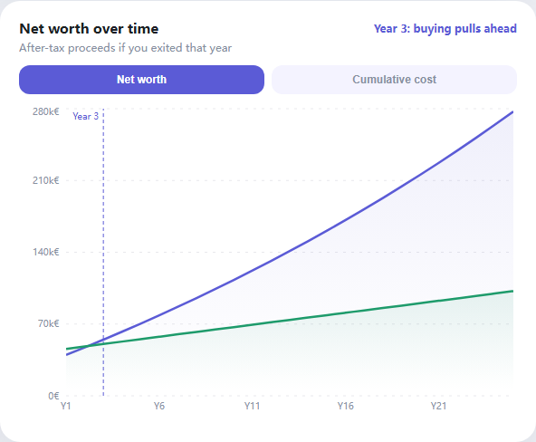
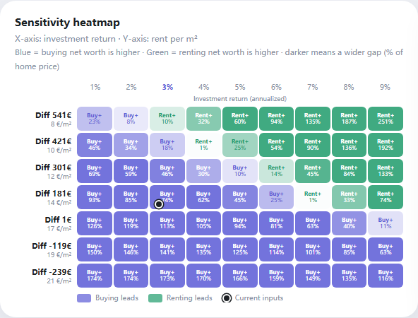
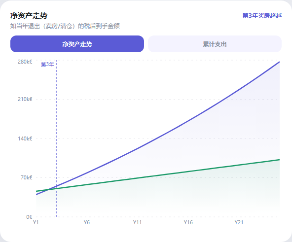
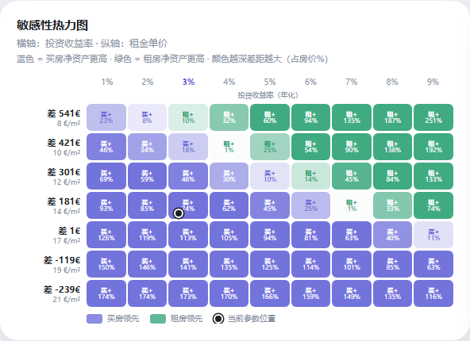

# Buy vs Rent Calculator

[中文说明](README.zh-CN.md)

Should you buy a home or keep renting? After the mortgage is fully paid off, which path leaves you with more assets? If you rent and invest the money you did not put into a home, can the portfolio catch up with property growth?

This interactive calculator helps you structure the financial side of the buy-vs-rent decision. Adjust inputs for your region and situation, then read the **net worth chart** and **sensitivity heatmap** to see how the conclusion changes.

## Live Demo

[https://jinda-li.github.io/buy-vs-rent/](https://jinda-li.github.io/buy-vs-rent/)

## Screenshots

Two views matter most: how net worth evolves over the loan term, and how sensitive the result is to rent and investment return.

### English UI

**Net worth over time** — after-tax proceeds if you exited in a given year (buying vs renting + investing).



**Sensitivity heatmap** — blue means buying leads, green means renting leads; darker cells show a larger gap.



### Chinese UI

**净资产走势** — 按年对比买房与租房（含投资）的税后可变现净资产。



**敏感性热力图** — 蓝色为买房领先，绿色为租房领先；颜色越深差距越大。



## Two Modes

**Mode 1: Same living area**

Compare buying and renting the same size home. This isolates the pure financial opportunity cost of putting capital into a property versus investing it in the market.

**Mode 2: Different living areas**

Compare a realistic choice: a smaller home you can afford to buy versus a larger home you can rent. The result includes the cost of the space difference.

## Core Assumption

The calculator compares two uses of the same starting capital:

- **Buying:** the down payment, transfer tax, and fees go into an owner-occupied home. Monthly cash flow covers mortgage payments and ownership costs. Ending wealth is estimated as property value minus remaining debt, selling costs, and any applicable capital gains tax.
- **Renting:** the same starting capital is invested on day one. The monthly difference between buying costs and rent is also invested. Ending wealth is the after-tax portfolio value.

This makes renting comparable only if the renter actually invests the saved cash. If the saved cash is spent, the result is a different lifestyle comparison rather than a like-for-like financial comparison.

## Important Disclaimer

The result is for reference only. It is meant to organize the costs and benefits of buying versus renting, not to give financial advice.

The output is highly sensitive to assumptions. Home price growth, annual rent growth, selling capital gains tax, ownership costs, mortgage rates, and investment returns vary significantly by region. A small change to extra monthly costs or expected investment return can change the conclusion.

I live in Helsinki, so the EUR mode uses defaults based on data I could collect for Helsinki in 2026. Please replace all defaults with your own local numbers before making any decision.

## Features

- Chinese and English UI, selected automatically from browser language.
- Manual 中文 / EN switch, remembered locally.
- Shareable URLs that preserve calculator inputs and language.
- EUR, CNY, USD, and GBP presets.
- Net worth chart, cumulative cost chart, sensitivity heatmap, and exportable long image.

## Local Development

```bash
npm install
npm run dev
```

Capture screenshots (dev server or preview must be running). The script saves a **full-page** image per language (`*-full.png`) and crops **net worth** / **heatmap** for README (`*-net-worth.png`, `*-heatmap.png`). Only the two crops are embedded above.

```bash
npx playwright install chromium
npm run build && npm run preview
# in another terminal:
node scripts/capture-readme-screenshots.mjs
```

Build for production:

```bash
npm run build
```

Preview the production build:

```bash
npm run preview
```

## License

MIT
